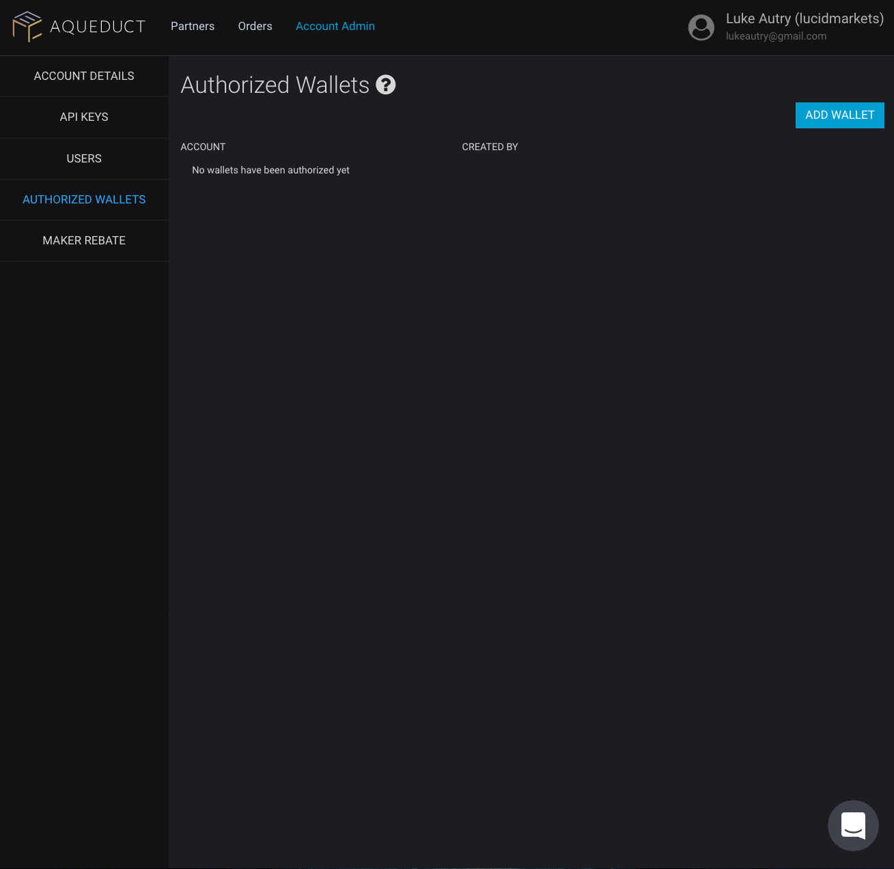
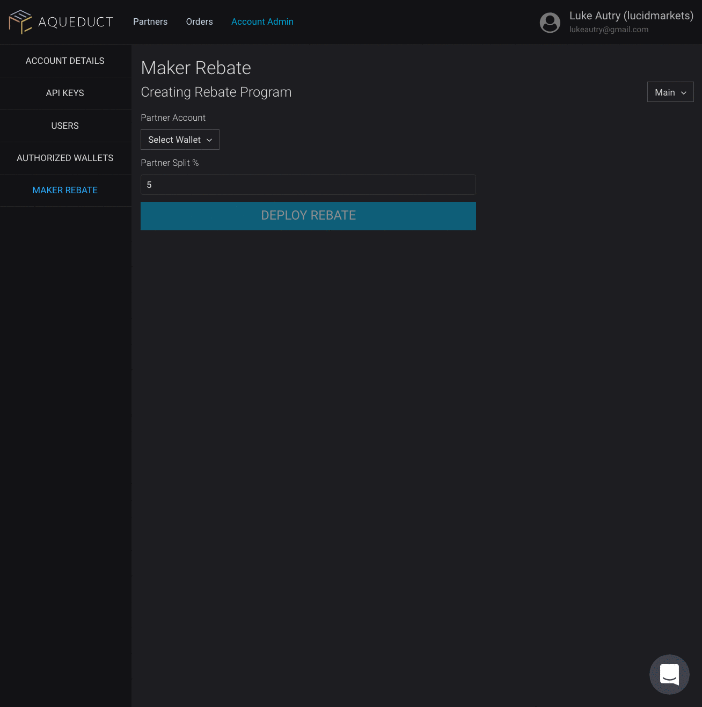
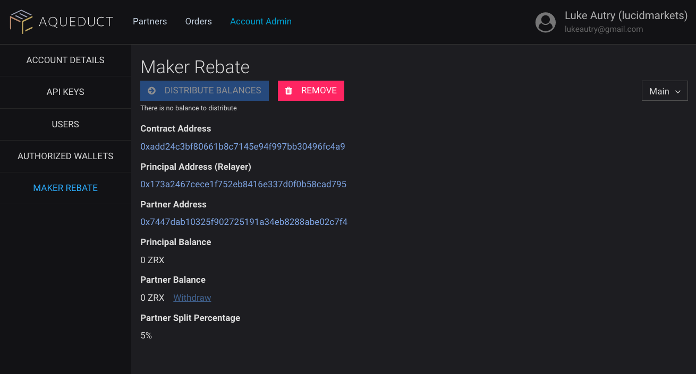
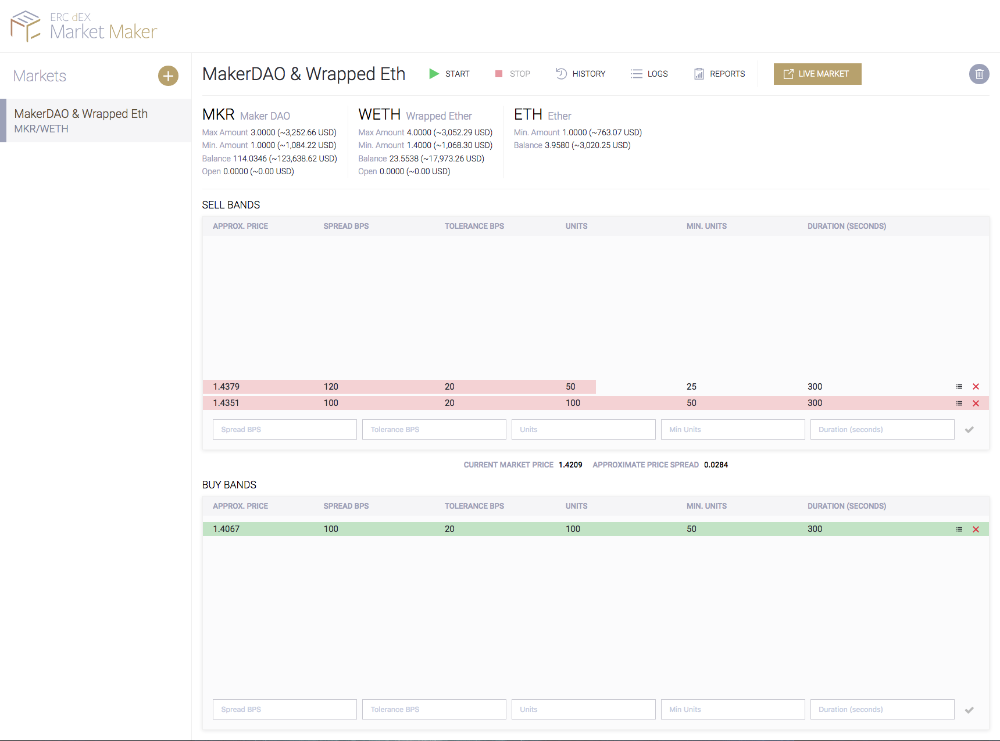

# Market Maker integrations

Market Maker refers to any person or group that opens resting, competitively priced orders.

## Overview

Partners open new orders ("Limit Orders") to buy or sell tokens. Management of orders can be done manually through the UI or using, our Aqueduct SDK, or with [the Automation Toolkit](https://github.com/ERCdEX/automation-toolkit).

Market makers may contact us to enter into a designated market maker agreement, which may enable favorable fee structures or rebates.

## Setup

### Register at https://portal.ercdex.com/#/register

Registration requires your personal and company information. A confirmation email will be sent out allowing you to confirm your account. ERC dEX will approve your account as a partner.

### Authorize one or more trading wallets

Authorized Wallets allow ERC dEX to link wallet activity to your member account.

### Create Rebate Contract

All registered market makers pay zero fees. Additionally, we offer an introductory rebate of 1 basis point (.01% of trade value, or 5% of the taker fee) to all registered market makers. The rebate is powered by a specialized smart contract that accepts fee payments and allows withdrawing those fees at an agreed upon rate. If you are a designated market maker (DMM), you may already have a rebate contract in place with an enhanced rebate structure.

The rebate will take effect on orders created after the contract has been successfully deployed.

## Trading

### Using the Automation Toolkit

The [Automation Toolkit](https://github.com/ERCdEX/automation-toolkit) tool is the easiest way to start making markets on ERC dEX. 

The toolkit offers a user-friendly UI and scripting capability, all in a secure, turn-key software package that supports both non-technical and highly technical traders.

### Using scripts/automation

The Aqueduct SDK offers a way to create automated trading. Review the primary [Aqueduct Documentation](../README.MD) for more information on how to begin with the SDK.

For a simple example on how to create orders with Aqueduct, review the example for [Placing a Limit Order](https://github.com/ERCdEX/aqueduct/blob/master/src/examples/placing-limit-order.ts).

### Using the UI

Limit orders opened in the UI will be connected back to your account if an authorized wallet is used.
