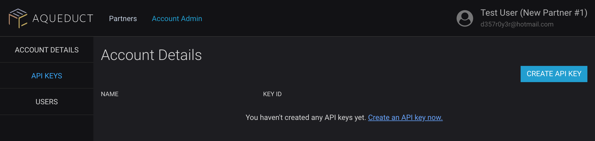

# 0x Relayer Integrations

The [0x protocol](https://0xproject.com/) allows sharing of liquidity between institutions using the open 0x messaging format. Relayers that use the [Open Orderbook Strategy](https://0xproject.com/wiki#Open-Orderbook) may participate in the network.

## Overview

One of the promises of the 0x protocol project is the ability to tap into a system of networked liquidity; several sources of 0x orders may exist across applications, helping produce more efficient markets in the relayers or partners that participate in this system. However, the 0x protocol does not explicitly specify the nature by which these orders should be shared or networked - by design, 0x is 'platform-agnostic'.

Aqueduct serves as a mesh application that aggregates 0x orders from many different sources and implements strategies that align economic incentives between cooperating organizations. Fee sharing is the primary incentive mechanism. By sharing fees, both 0x order originators and 0x order distributors are incentivized to pull and push their orders within the network.

## Setup

## Sign up for member portal access

### Visit https://portal.ercdex.com/#/register

Registration requires your personal and company information. A confirmation email will be sent out allowing you to confirm your account. ERC dEX will approve your account as a partner.

## Creating API Keys

API keys are used to identify your account when making API calls using Aqueduct or raw REST API calls. You can create API keys once logged into the portal in Account Admin -> Api Keys -> Create Api Key:



### Initializing Aqueduct Client with API Key

```
import { Aqueduct } from '@ercdex/aqueduct';

Aqueduct.Initialize({
    apiKeyId: 'xxxxx'
});
```

### Sending Api Key with Raw Requests

Set request header 'X-API-KEY-ID' to API Key ID.

## Implementation

Relayer partners are expected to join the network by implementing the following requirements:

- Contact us at partners@ercdex.com or in our slack to initiate the integration on the Aqueduct side - partners implementing the Standard Relayer API can be plugged into existing infrastructure
- Pull orders from Aqueduct using either the REST API/Events API/Aqueduct SDK. The Aqueduct SDK is the easiest option.
- Claim transactions filled on your application. When an order *not* originated by your application is filled on your platform, you should call the [Claim](https://aqueduct.ercdex.com/rest.html#operation/Claim) operation using your API key. This allows us to process the transaction as having been initiated on your platform.

